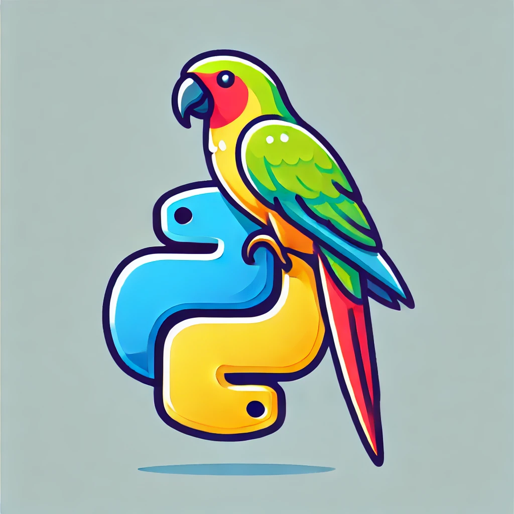

# MII_CC_UGR

Repositorio para almacenar las prácticas de CC del curso 24-25 del MUII en la UGR.

## Descripción del proyecto
El proyecto **AIChronos** consistirá en la creación de una aplicación que permita la interactuación con un agente inteligente al cuál será accedible mediante el loggeo del usuario y con el que podrá consultar temas generales al mismo tiempo que crear eventos en Google Calendar.

## Hito 1
- 📄 [Descripción detallada del proyecto](./docs/hito1.md)
    - Conoce en profundidad los objetivos, alcance y funcionalidades clave del proyecto.
    - Conoce las tecnologías empleadas [aquí](./docs/hito1/tecnologies.md).
- 🛠️ [Configuración del repositorio](./docs/hito1/config_repo.md)
    - Sigue los pasos llevados a cabo para configurar el repositorio.
- 📜 [Licencia](./LICENSE)
    - Revisa los términos y condiciones de la licencia de MIT.

## Desarrollo y Evolución
### Milestones
Para conocer los hitos del desarrollo del proyecto pulse [aquí](./docs/hito1/milestones.md).

### Historias de Usuario
Para conocer las historias de usuario del proyecto pulse [aquí](./docs/hito1/hu.md).

## Autores
- Ventura Lastrucci Carriazo, v.lastrucci.c@gmail.com
