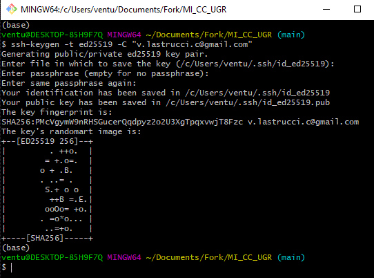
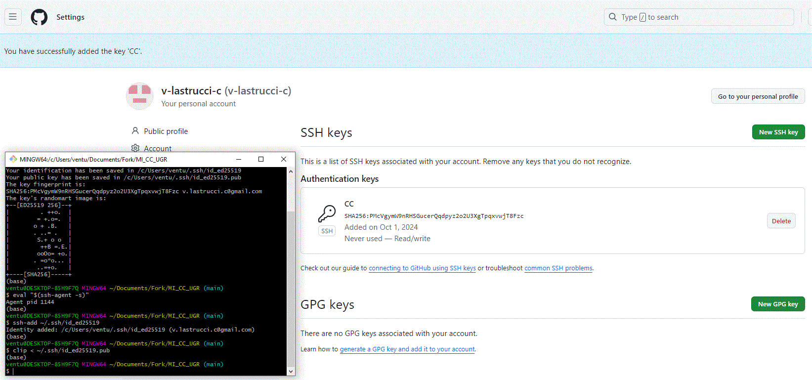
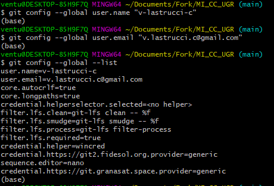
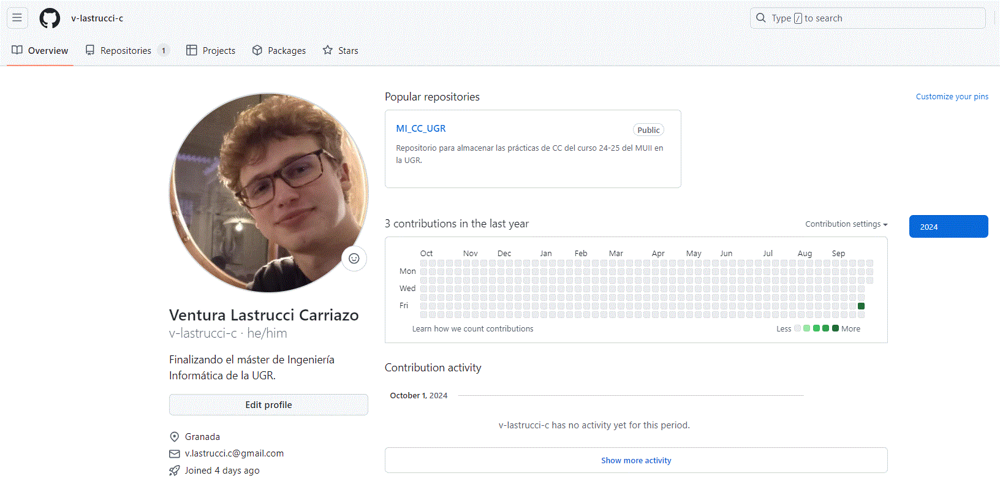
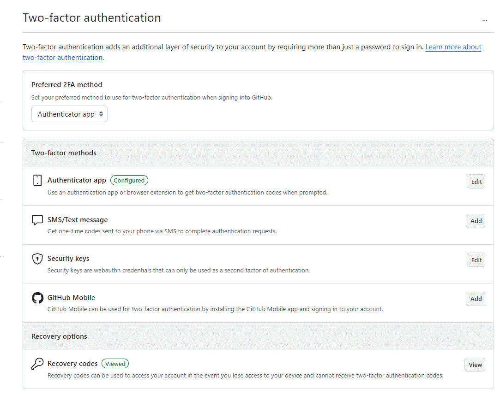

# Configuración del Repositorio de GitHub

Este documento muestra los pasos llevados a cabo para configurar el repositorio de GitHub mediante la creación de claves SSH, la personalización del perfil y la activación de medidas de seguridad adicionales.

## Creación y asociación de claves SSH

Las claves SSH permiten una comunicación segura entre la máquina local y GitHub, eliminando la necesidad de ingresar las credenciales cada vez que interactúas con el repositorio.

1. **Generación de la clave SSH:**
   
   

   *En esta imagen, se muestra cómo generar una nueva clave SSH utilizando Git Bash.*

2. **Adición de la clave SSH:**
   
   

   *Aquí se ilustra cómo agregar la clave SSH recién creada al agente SSH.*

## Configuración del nombre y del correo electrónico para que aparezcan en los commits

*Esta imagen muestra cómo establecer tu nombre completo y correo electrónico a nivel global en Git.*

## Edición del Perfil de GitHub

*En esta captura se evidencia el proceso de edición del perfil donde se ha agregado la imagen, el nombre completo, la ubicación y la universidad.*

## Activar Segundo Factor de Seguridad

Para proteger la cuenta de GitHub se ha habilitado la autenticación de dos factores (2FA) a través de una aplicación.

*La imagen ilustra que se ha configurado el método de dos pasos mediante una aplicación de autenticación.*

## Documentación Adicional
1. [Milestones](milestones.md)
2. [Historias de Usuario](hu.md)
3. [Descripción detallada del proyecto](../hito1.md)
4. [Inicio](../../README.md)
