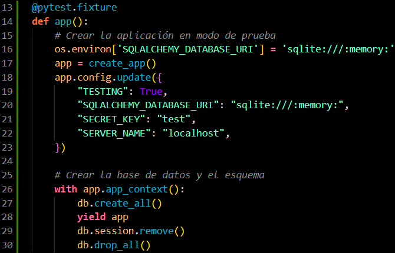
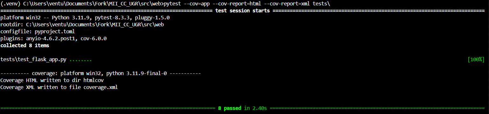
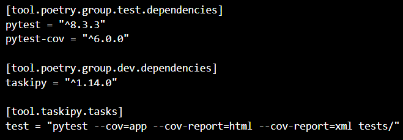
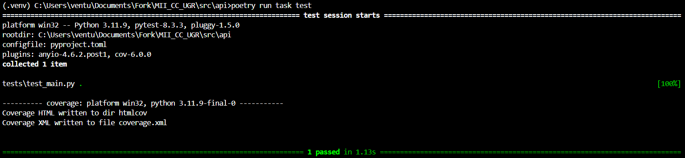
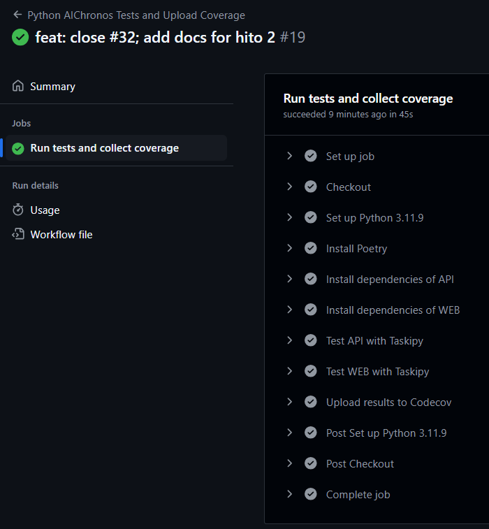
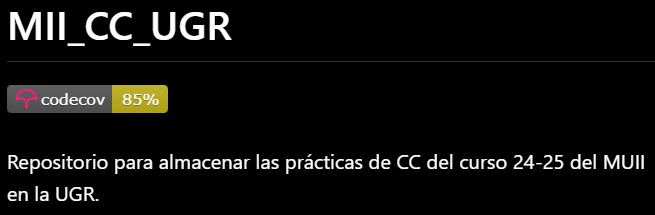

# Configuración de la Integración Continua

Para desarrollar la integración continua del proyecto hemos realizado la configuración e implementación de los siguientes apartados.

## Marco de Pruebas y Librería de Aserciones

La librería empleada para satisfacer tanto el marco de pruebas como la librería de aserciones ha sido **Pytest**. Para contemplar los tests implementados podemos irnos a las carpetas `tests` que se encuentran en los microservicios de [web](../src/web/tests/) y [api](../src/api/tests/):



Para contemplar los resultados de la ejecución de los tests usando el marco de pruebas de **Pytest** de un microservicio podemos ubicarnos en el directorio [web](../src/web/) o [api](../src/api/) correspondiente y ejecutar el siguiente comando:

```bash
pytest --cov=app --cov-report=html --cov-report=xml tests\
```


*Ejecución del marco de pruebas sobre `web`*

## Gestor de Tareas
La herramienta empleada para definir las tareas a ejecutar ha sido **Taskipy**. Para configurarlo hemos añadido las siguientes secciones al `pyproject.toml` de [web](../src/web/pyproject.toml) y al de [api](../src/api/pyproject.toml):





Para ejecutar el _task runner_ nos ubicamos en los directorios [web](../src/web/) o [api](../src/api/) respectivamente y lanzamos el siguiente comando:

```bash
poetry run task test
```


*Ejecución del gestor de tareas sobre `api`*


## Integración Continua
El gestor de integración continua elegido ha sido **Github Actions**, para ello hemos implementado el archivo [aichronos-pytest.yml](../.github/workflows/aichronos-pytest.yml) donde definimos un `job` que se va a encargar de instalar las dependencias correspondientes y a la ejecución del gestor de tareas en ambos microservicios. Asimismo hemos añadido una sección adicional para hacer uso de los informes de `coverage` que generamos para que sean administrados por [Codecov](https://about.codecov.io/) y poder representar el porcentage de cobertura del código con un badge en el [README](../README.md).

```yaml
name: Python AIChronos Tests and Upload Coverage

on:
  push:
    branches: [ "main", "hito2" ]
  pull_request:
    branches: [ "main" ]

permissions:
  contents: read

jobs:
  test:
    name: Run tests and collect coverage
    runs-on: ubuntu-latest
    steps:
    - name: Checkout
      uses: actions/checkout@v4
      with:
        fetch-depth: 0
...
```



*Para ver más resultados de la ejecución del workflow de Integración Continua clique [aquí](https://github.com/v-lastrucci-c/MII_CC_UGR/actions)*.




*Badge de Codecov*

## Documentación Adicional
1. [Librería de Aserciones](./hito2/assertion_library.md)
2. [Marco de Pruebas](./hito2/testing_framework.md)
3. [Gestor de Tareas](./hito2/tasks_manager.md)
4. [Integración Continua](./hito2/continous_integration.md)
5. [Uso del Repo](./hito2/repo_usage.md)
6. [Inicio](../README.md)