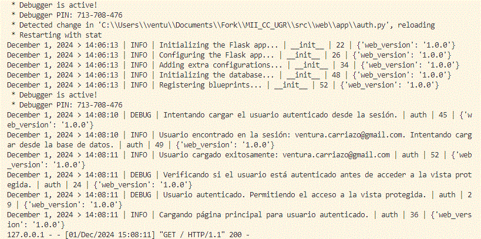
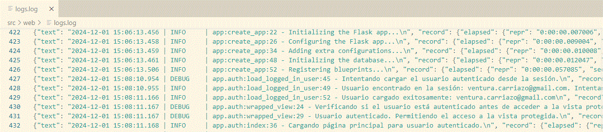
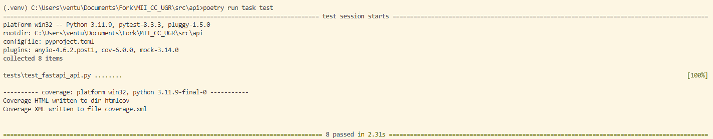

# Diseño de Microservicios

El diseño llevado a cabo para el desarrollo del proyecto se fundamenta en la construcción de dos microservicios: la API y la aplicación web.

## Aplicación Web

Este microservicio gestiona la administración de usuarios, incluyendo el registro y el inicio de sesión. Para acceder a la página principal, que presenta el portal para la interacción con el modelo, es necesario haber iniciado sesión.

Los endpoints desarrollados para cumplir este cometido son los siguientes:
- **`/register`**: [Endpoint](../src/web/app/auth.py) utilizado para registrar nuevos usuarios en el sistema.
- **`/login`**: [Endpoint](../src/web/app/auth.py) diseñado para autenticar a los usuarios existentes.
- **`/`**: [Endpoint](../src/web/app/auth.py) que proporciona acceso a la página principal una vez iniciada la sesión.


## API

Este microservicio gestiona las interacciones con el modelo a partir de los mensajes que los usuarios introducen en la página principal de la aplicación web. Además, dispone de rutas para obtener información de un usuario a través de su email, consultar métricas destacadas derivadas de las interacciones con el modelo y realizar un healthcheck de la API.

Los endpoints desarrollados son los siguientes:
- **`/api/v1/llm/prompt`**: [Endpoint](../src/api/app/routers/prompt.py) que procesa los mensajes enviados por los usuarios (junto con su `user_id`) y devuelve respuestas generadas por el modelo.
- **`/api/v1/profile/{user_email}`**: [Endpoint](../src/api/app/routers/profile.py) que permite recuperar toda la información asociada a un usuario específico mediante su email.
- **`/api/v1/stats/summary`**: [Endpoint](../src/api/app/routers/stats.py) que presenta estadísticas clave sobre el modelo, como el número de interacciones totales y usuarios únicos.
- **`/api/v1/health`**: [Endpoint](../src/api/app/routers/healthcheck.py) que verifica el estado operativo de la API y confirma que está funcionando correctamente.


## Logs

Se ha implementado una gestión exhaustiva de logs para todos los endpoints. Como se describe en la [Descripción detallada de la elección del logger](hito3/logger.md), se ha elegido la librería **Loguru** debido a su facilidad de uso y personalización. El logger ha sido [configurado](../src/web/app/logger_config.py) para gestionar dos mecanismos para el manejo de logs:
- **Salida por terminal**: Los logs se muestran directamente en el terminal durante la ejecución de la aplicación.
    
  *Logs mostrados en el terminal de la aplicación web.*

- **Almacenamiento en archivo**: Los logs también se almacenan en un archivo llamado `logs.log`, que posteriormente puede ser guardado en un volumen para facilitar su análisis.
    
  *Logs recopilados en el archivo `logs.log` de la aplicación web.*

## Tests

Antes de implementar los endpoints, se desarrollaron pruebas exhaustivas para validar su funcionalidad y garantizar que cumplen con los requisitos esperados. Estas pruebas verifican tanto los casos de éxito como los posibles errores que podrían ocurrir en diferentes escenarios.

Las pruebas pueden ejecutarse mediante el task manager seleccionado durante el [Hito 2](./hito2.md) utilizando el siguiente comando:

```bash
poetry run task test
```

El resultado de las pruebas se muestra a continuación:


*Resultados de los test de la API*

## Documentación Adicional
1. [Justificación técnica del framework elegido para la API](./hito1/tecnologies.md)
2. [Librerías de Logging](./hito3/logger.md)
3. [Inicio](../README.md)
