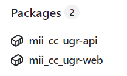
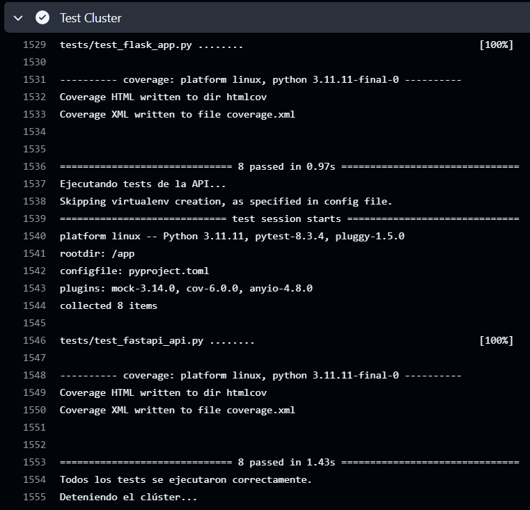

# Despliegue de los Microservicios

## Estructura del clúster de contenedores

El clúster de contenedores está compuesto por tres servicios principales que se gestionan a través del archivo `compose.yml`:

1. **aichronos-web:** Servicio que gestiona el frontend de la aplicación.
2. **aichronos-api:** Servicio que implementa la API de backend.
3. **aichronos-db:** Servicio que proporciona la base de datos PostgreSQL para la aplicación.

Todos los servicios están interconectados y definidos en el archivo de composición, asegurando que las dependencias sean resueltas automáticamente.

Para más detalles, consulta la [Documentación del compose.yml](./hito4/compose.md).


## Configuración de los contenedores

Los microservicios están configurados usando Dockerfiles optimizados para entornos de desarrollo y producción. Se han tomado decisiones estratégicas sobre las imágenes base:

1. **Frontend y Backend:** Utilizan `python:3.11-slim` para reducir el tamaño de las imágenes y mejorar la velocidad de construcción.
2. **Base de Datos:** Se emplea la imagen oficial `postgres:15` para garantizar estabilidad y rendimiento.

### Justificación del uso de `postgres:15`

Se utiliza la imagen oficial `postgres:15` en lugar de otras alternativas debido a:

1. **`postgres:alpine`**
   - **Ventajas:**
     - Imagen extremadamente ligera (~5 MB comprimido), ideal para entornos donde el tamaño de la imagen es crítico.
   - **Desventajas:**
     - Mayor complejidad al configurar extensiones o dependencias que requieren compilación nativa.
     - Menor compatibilidad con herramientas avanzadas y librerías debido a su enfoque minimalista.

2. **`postgres:latest`**
   - **Ventajas:**
     - Garantiza siempre la última versión estable, sin necesidad de actualizar manualmente.
     - Buena compatibilidad con herramientas y configuraciones estándar.
   - **Desventajas:**
     - Puede causar problemas de compatibilidad con entornos ya desplegados si la versión cambia inesperadamente.

**Decisión:** Se elige `postgres:15` porque combina estabilidad (versión fija), características modernas y facilidad de uso, a la vez que evita los problemas de tamaño de `postgres:alpine` y la incertidumbre de actualizaciones automáticas de `postgres:latest`.


## Publicación a Github Packages
Como se describe en [Documentación sobre la actualización, subida y publicación a Github Packages](./hito4/github_packages.md), se automatiza la subida y publicación de la aplicación web y de la api a Github Packages.



*Paquetes visibles en el repositorio*

## Ejecución del test para validar el funcionamiento del cluster

La validación del clúster de contenedores se realiza mediante un script automatizado llamado `test_cluster.sh`. Este script se encarga de construir, levantar y probar los servicios interconectados aprovechando los tests desarrollados durante hitos anteriores, asegurando que el clúster funcione correctamente.

### Pasos del Proceso de Testeo

1. **Construcción y Levantamiento del Clúster**  
   El script utiliza `docker compose` para construir las imágenes y levantar los contenedores definidos en el archivo `compose.yml`. Este proceso asegura que todos los servicios estén en funcionamiento y disponibles para las pruebas.
   ```bash
   docker compose up --build -d
   ```

2. **Espera para la Inicialización de los Servicios**  
   Algunos servicios, como la base de datos, pueden necesitar tiempo adicional para inicializarse. El script incluye un retraso configurado con `sleep 10` para garantizar que los servicios estén listos antes de ejecutar las pruebas.

3. **Ejecución de Tests Unitarios y de Integración**  
   Los tests específicos de cada microservicio se ejecutan desde sus respectivos contenedores utilizando `poetry run task test`.  
   ```bash
   docker exec aichronos-web poetry run task test
   docker exec aichronos-api poetry run task test
   ```

4. **Detención del Clúster**  
   Al finalizar las pruebas, el script desmonta todos los contenedores para liberar los recursos.
   ```bash
   docker compose down
   ```

### Automatización con GitHub Actions

El test del clúster está integrado como un paso previo a la publicación de las imagenes a Github Packages para no realizarlo en caso de posibles fallos.

El siguiente bloque YAML en el flujo de trabajo define el paso para ejecutar el test del clúster:

```yaml
- name: Test Cluster
  run: |
    chmod +x ./test_cluster.sh
    ./test_cluster.sh
```



*Ejecución de los tests sobre el clúster*

## Documentación Adicional

1. [Documentación sobre los Dockerfiles de los Microservicios](./hito4/dockerfiles.md)
2. [Documentación sobre el fichero de composición del clúster](./hito4/compose.md)
3. [Documentación sobre la actualización, subida y publicación a Github Packages](./hito4/github_packages.md)
4. [Descripición detallada de las imágenes base empleadas](./hito4/base_image.md)
5. [Inicio](../README.md)
