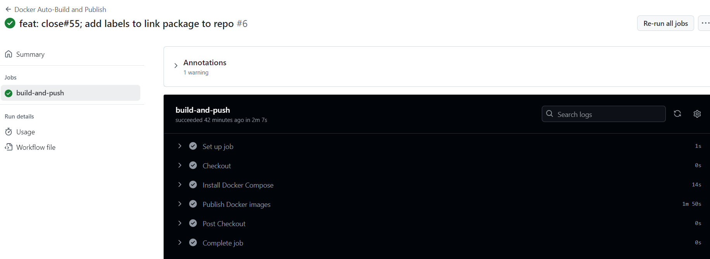

# Documentación para Actualización Automática y Subida a GitHub Packages

En este documento describiremos el flujo de trabajo configurado en GitHub Actions para automatizar la construcción de los contenedores Docker y su publicación en **GitHub Container Registry**.

## Eventos que Activan el Workflow

El flujo de trabajo se ejecuta automáticamente en los siguientes casos:
- **Push** a la rama `main`.
- **Pull Request** hacia la rama `main`.

```yaml
on:
  push:
    branches:
      - main
  pull_request:
    branches:
      - main
```

## Jobs

### 1. **build-and-push**
Encargado de construir y publicar las imágenes Docker.

#### **Configuración del Entorno**
- **Sistema Operativo:** `ubuntu-latest`
- **Permisos:**
  - `contents: read` → Permite acceso de solo lectura al contenido del repositorio.
  - `packages: write` → Permite publicar imágenes en GitHub Container Registry.

```yaml
jobs:
  build-and-push:
    runs-on: ubuntu-latest
    permissions:
      contents: read
      packages: write
```

### Pasos del Job

#### **1. Checkout del Repositorio**
Clona el repositorio para obtener los archivos necesarios para la construcción.

```yaml
- name: Checkout
  uses: actions/checkout@v4
  with:
    fetch-depth: 0
```

- **Uso:** Se usa `actions/checkout@v4` con `fetch-depth: 0` para obtener todo el historial del repositorio.

#### **2. Instalación de Docker Compose**
Instala `docker-compose` en el entorno del runner.

```yaml
- name: Install Docker Compose
  run: |
    sudo apt-get update
    sudo apt-get install -y docker-compose
```

- **Uso:** Este paso asegura que el entorno tiene acceso a `docker-compose`, requerido para construir y manejar los contenedores definidos en `compose.yml`.

#### **3. Publicación de Imágenes Docker**
Utiliza la acción `soltys/publish-docker-compose` para construir y publicar las imágenes Docker en GitHub Container Registry.

```yaml
- name: Publish Docker images
  uses: soltys/publish-docker-compose@v1.0.0
  with:
    version: 'latest'
    docker_compose: 'compose.yml'
    repo_token: "${{ secrets.AICHRONOS_TOKEN }}"
```

- **Parámetros:**
  - `version: 'latest'` → Publica las imágenes con la etiqueta `latest`.
  - `docker_compose: 'compose.yml'` → Especifica el archivo de configuración para los servicios Docker.
  - `repo_token: "${{ secrets.AICHRONOS_TOKEN }}"` → Usa un token personalizado almacenado como secreto (`AICHRONOS_TOKEN`) para autenticarse y publicar en el registro.


  
*Resultado exitoso del workflow para la publicación de las imagnes en Github Packages*


### Ejecución Manual
Este flujo de trabajo se ejecuta automáticamente en los eventos definidos, pero también puede ejecutarse manualmente desde la interfaz de GitHub Actions.


## Documentación Adicional

1. [Documentación sobre los Dockerfiles de los Microservicios](dockerfiles.md)
2. [Documentación sobre el fichero de composición del clúster](compose.md)
3. [Descripición detallada de las imagenes base empleadas](base_image.md)
4. [Inicio](../../README.md)