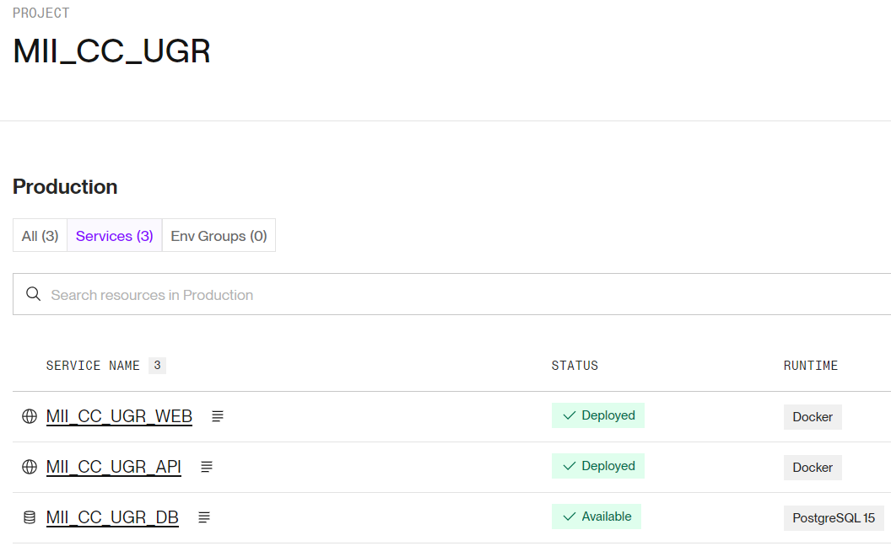
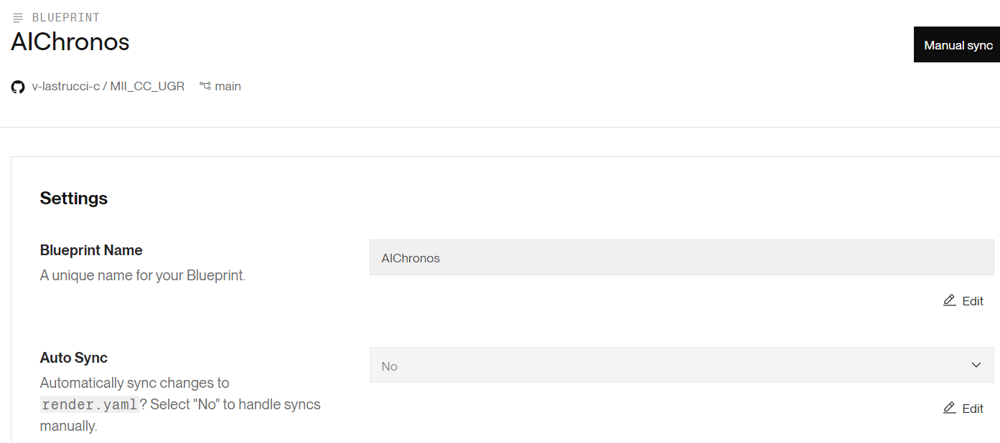
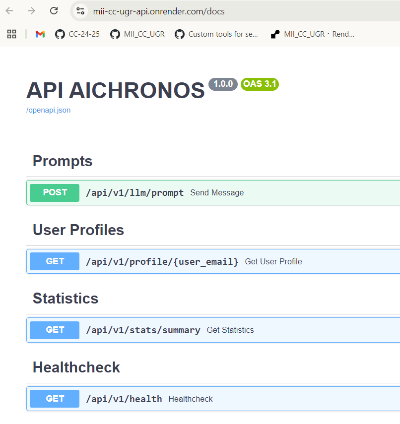
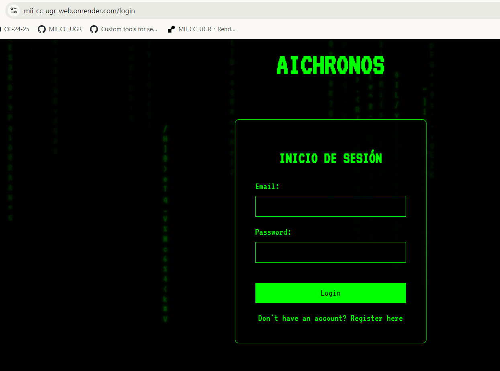
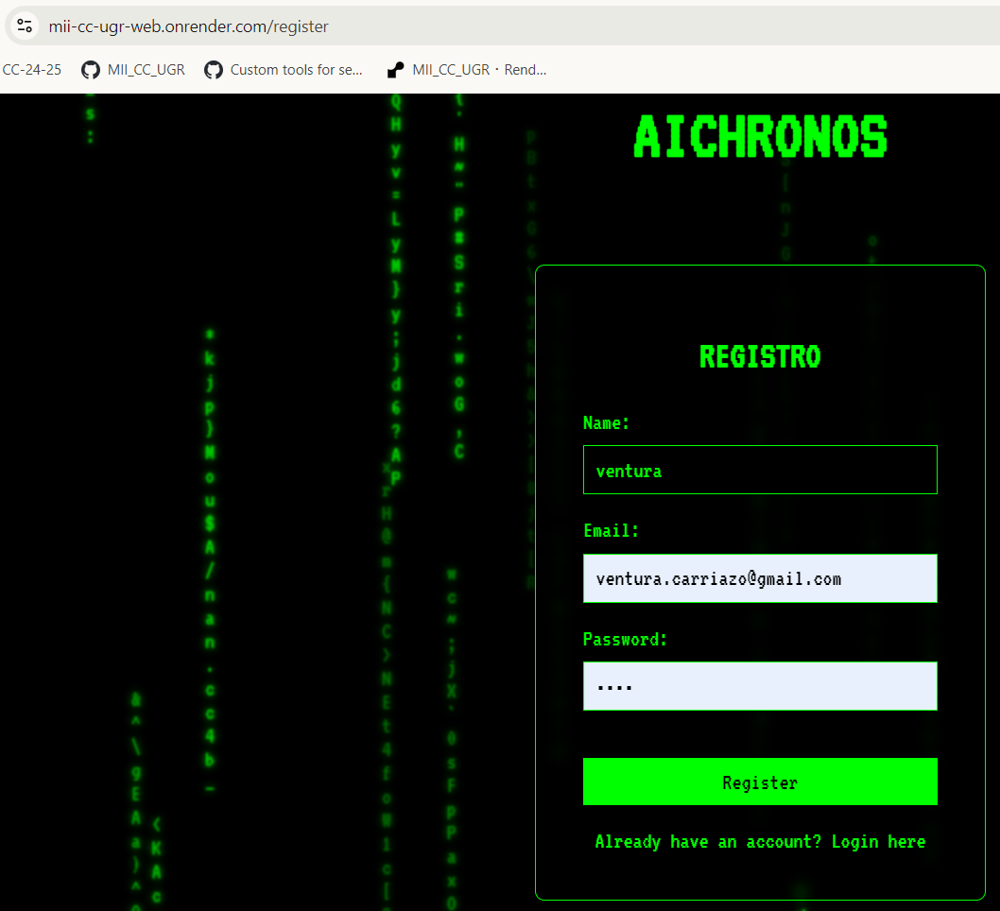
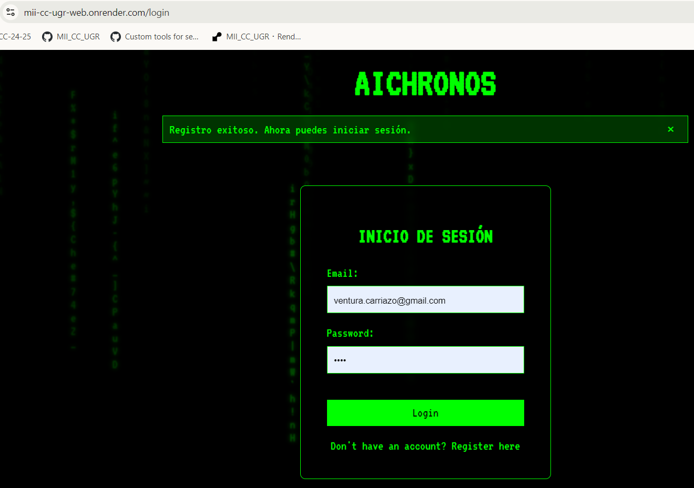
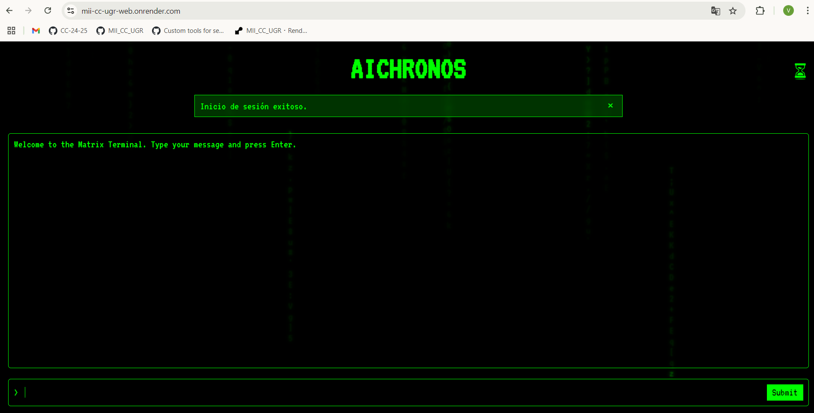
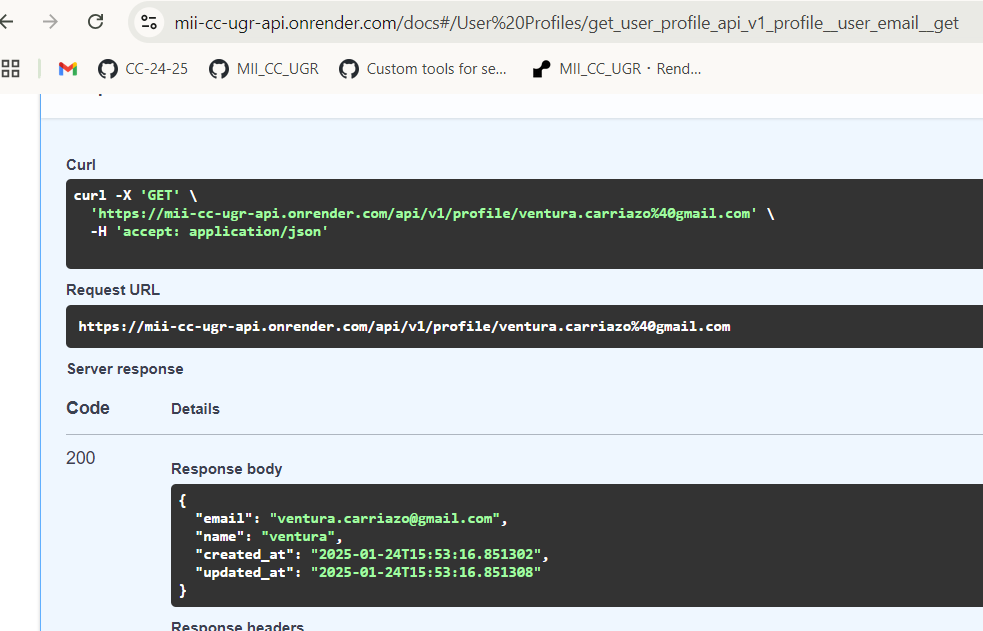

# Despliegue de los microservicios al PaaS

Esta documentación repasa el proceso de comparativa y de despliegue automático al PaaS **Render** haciendo uso de **GitHub Actions**. Asimismo se muestra el funcionamiento y pruebas sobre los servicios desplegados.

## 1. Comparativa de Plataformas PaaS
En primer lugar hemos realizado una comparativa entre los servicios PaaS de Google App Engine (GAE), Fly.io y Render para determinar la mejor plataforma para el despliegue. Render fue seleccionada debido a su simplicidad, costos competitivos y soporte completo para servicios.

> Más información: [Comparativa de Plataformas PaaS](./hito5/paas_selection.md)

## 2. Despliegue de los Servicios en Render
En segundo lugar hemos llevado a cabo el despliegue de los servicios en Render. Para ello hemos creado un proyecto llamado `MII_CC_UGR` que contendrá los servicios.

Para la creación de los despliegues de los servicios hemos creado dos servicios web, para la api y para la web, los cuales están conectados con el repositorio, y sobre los que eligiendo Docker y especificando su ruta correcta junto con las variables de entorno de cada uno hemos finalizado el despliegue de estos dos servicios. Adicionalmente, Render facilita la creación de un servicio PostgreSQL, del cual una vez creado especificando el usuario y el nombre de la base de datos, hemos copiado el `Internal Database URL` y lo hemos pegado en las variables de entorno de los otros dos servicios, `SQLALCHEMY_DATABASE_URI` y `DATABASE_URL`, para asegurar la conexión entre ambos servicios y la base de datos.

Tras haber finalizado el despliegue de los servicios hemos generado los blueprints y creado el archivo `render.yaml` que contiene la configuración de la infraestructura como código. Gracias a la conexión entre Render y el repositorio, este puede detectar cambios en el blueprint y automatizar los despliegues de las aplicaciones si ha habido cambios en ellas. Como nosotros vamos a automatizar el despliegue de los servicios mediante GitHub Actions, hemos deshabilitado la opción de sincronización automática.

## 3. Comprobación del funcionamiento correcto de los servicios desplegados
Los distintos servicios `API` y `Web` son accesibles mediante los siguientes enlaces:
- `API`: https://mii-cc-ugr-api.onrender.com/docs

    

- `Web`: https://mii-cc-ugr-web.onrender.com/

    

Para testear en mayor medida el funcionamiento de los despliegues realizaremos el registro de un usuario:

Y a continuación iniciar sesión:

Asimismo testearemos el endpoint de la api, donde obtendremos la información del usuario que acabamos de crear:

> Más información: [Descripción del archivo render.yaml](./hito5/deployment_tool.md)

## 3. Configuración de GitHub Actions
Una vez hemos realizado el despliegue de los servicios en Render, hemos configurado un flujo de trabajo de GitHub Actions para desplegar automáticamente los servicios API y Web de la aplicación en Render haciendo uso de la acción personalizada `JorgeLNJunior/render-deploy`.
- **Ventajas:**
  - Automatización completa
  - Despliegue modular para API y Web
  - Seguridad al utilizar secretos en GitHub

> Más información: [Configuración de GitHub Actions](deploy_githubActions.md)

## Documentación Adicional

1. [Documentación sobre la comparativa entre los PaaS](./hito5/paas_selection.md)
2. [Documentación sobre la herramienta de despliegue Render](./hito5/deployment_tool.md)
3. [Documentación sobre el despliegue automatizado mediante GitHub Acitons](./hito5/deploy_githubActions.md)
4. [Inicio](../README.md)